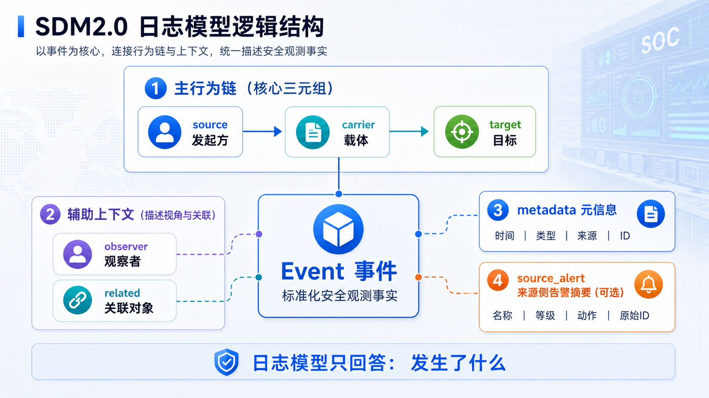
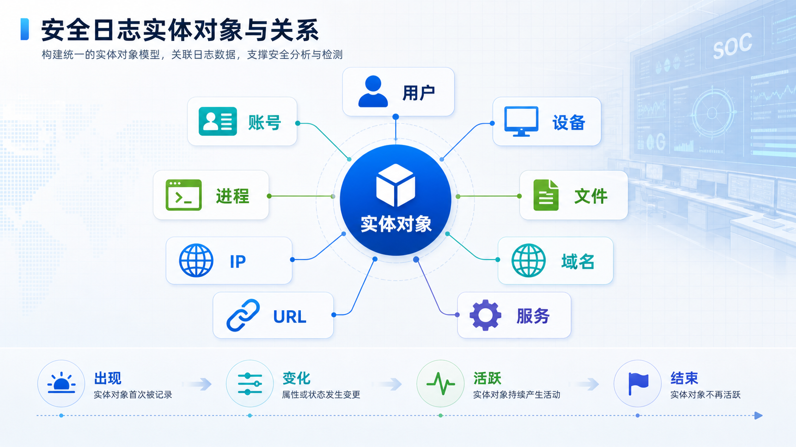
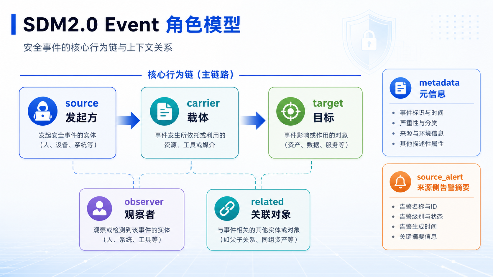
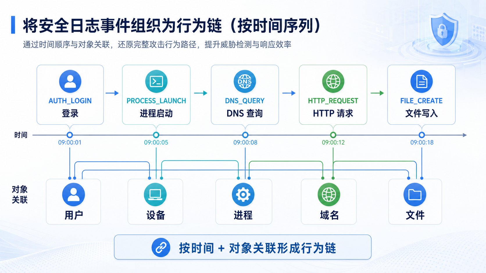
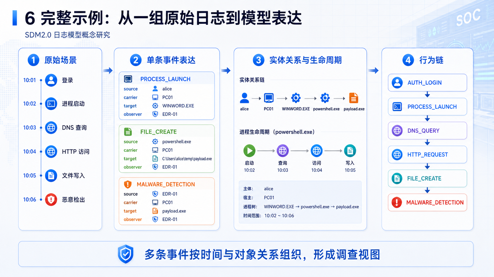

# SDM2.0 日志模型概念研究

> **产品定位：** SDM2.0 日志模型是一套面向自研安全运营平台（SOC）的统一安全观测数据模型。它定义安全设备、业务系统、终端 Agent、网络设备和云平台产生的日志，如何在平台内被统一表达、检索、关联和理解。
>
> **核心理念：** 将碎片化的厂商日志统一为以 Event 为核心的事件语义。Event 表示一条标准化后的安全观测事实，用 `source / carrier / target` 描述主行为链，用 `observer / related` 补充观察视角和额外线索。日志模型只回答"发生了什么"，不直接回答"有没有问题"和"怎么处置"。

---

## 一、模型定位与边界

SDM2.0 日志模型的基本单位是 Event。每一条接入平台的原始日志，经过解析和标准化后，应尽量表达为一条或多条标准化事件。



```
Event 事件
  ├── 主行为链：source → carrier → target
  ├── 辅助上下文：observer / related
  ├── 事件元信息：metadata
  └── 来源侧告警摘要：source_alert（可选）
```

日志模型的核心目标是让不同来源、不同厂商、不同格式的日志，能够落到同一套安全语义中：

| 组成 | 回答的问题 | 示例 | 数据性质 |
|------|-----------|------|---------|
| Event | 刚刚发生了什么？ | 登录、进程创建、网络连接、文件写入 | 行为事实 |
| 角色对象 | 谁参与了这件事？ | 用户、账号、设备、进程、文件、服务 | 事件内对象表达 |
| metadata | 这条记录本身是什么？ | 事件 ID、发生时间、来源、类型 | 记录属性 |
| source_alert | 来源侧是否自带安全判断？ | EDR 检出、WAF 告警、防火墙阻断 | 可选观测信息 |

日志模型需要明确边界：

| 能力 | 是否属于日志模型 | 说明 |
|------|----------------|------|
| 表达单条观测事实 | 是 | 例如谁登录、哪个进程启动、访问了哪个域名 |
| 保留事件中的实体对象 | 是 | 用户、账号、设备、进程、文件、IP、域名、URL 等 |
| 支撑实体关系和时间线 | 是 | 事件需要保留可关联的对象和时间 |
| 生成平台告警 | 否 | 告警是检测、聚合和研判结果 |
| 处置状态和工单流转 | 否 | 属于告警、案件或 SOAR 模型 |
| 维护资产归属和实体画像 | 否 | 可由资产/实体上下文服务维护 |

其中，实体不是日志模型中的独立层，而是事件角色里的对象表达。例如用户、设备、进程、文件可以分别出现在 `source`、`carrier`、`target`、`observer` 或 `related` 中。实体关系、资产归属、历史状态、风险评分等上下文能力可以由资产/实体上下文服务提供，但不是单条日志事件自身必须携带的内容。

如果原始日志本身就是外部安全产品产生的告警日志，日志模型可以通过 `source_alert` 保留来源侧告警摘要。这里的 `source_alert` 是原始观测事实的一部分，不是 SDM 平台统一生成的 Alert，也不包含处置状态、分派人、工单流转等告警生命周期信息。

---

## 二、实体对象 —— 日志中出现的对象类型

在日志模型中，实体对象指事件中出现的人、账号、设备、程序、资源或网络对象。它们被放入事件角色中，用来说明谁参与了这条行为，以及行为与哪些对象有关。



常见实体对象及主要字段包括：

| 实体对象 | 说明 | 主要字段 |
|---------|------|----------|
| 用户 | 自然人用户或业务使用者 | `user.id`, `user.name`, `user.display_name`, `user.email`, `user.department`, `user.title` |
| 账号 | 系统账号、应用账号、服务账号等身份主体 | `account.id`, `account.name`, `account.domain`, `account.type`, `account.status`, `account.privilege_level` |
| 设备 | 主机、服务器、终端、安全设备、网络设备等 | `host.id`, `host.hostname`, `host.ip`, `host.mac`, `host.os`, `host.type`, `host.serial_number`, `host.agent_id` |
| 进程 | 正在运行或被记录的程序实例 | `process.entity_id`, `process.pid`, `process.guid`, `process.name`, `process.path`, `process.cmdline`, `process.parent_pid`, `process.parent_guid`, `process.hash` |
| 文件 | 文件、附件、载荷、脚本、可执行文件等 | `file.name`, `file.path`, `file.directory`, `file.extension`, `file.md5`, `file.sha256`, `file.size`, `file.type` |
| 服务 | 系统服务、业务服务、中间件、数据库服务等 | `service.id`, `service.name`, `service.type`, `service.port`, `service.protocol`, `service.product`, `service.version` |
| IP | IPv4/IPv6 地址、内外网地址、NAT 地址等 | `ip.address`, `ip.version`, `ip.type`, `ip.cidr`, `ip.nat_ip`, `ip.asn`, `ip.geo` |
| 域名 | DNS 查询域名、访问域名、邮件域名等 | `domain.name`, `domain.registered_domain`, `domain.subdomain`, `domain.tld`, `domain.record_type` |
| URL | Web 请求地址、下载链接、邮件正文链接等 | `url.full`, `url.scheme`, `url.domain`, `url.path`, `url.query`, `url.port`, `url.category` |
| 协议/会话 | 网络协议、应用协议、连接会话等 | `network.session_id`, `network.protocol`, `network.application_protocol`, `network.direction`, `network.src_port`, `network.dst_port`, `network.bytes`, `network.packets` |

同一个实体对象在不同事件中可以承担不同角色。例如同一个 IP 在一次连接中可能是 `source`，在另一次连接中可能是 `target`；同一个文件在邮件投递中可能是 `carrier`，在文件修改事件中可能是 `target`。

实体字段需要尽量保留可归并线索。对于用户、账号、设备、进程这类会跨事件反复出现的对象，仅有展示名称通常不够，还需要保留 ID、域、命名空间、Agent ID、GUID、Hash 等稳定或半稳定标识。实体归并不一定在单条事件内完成，但事件必须提供后续归并所需的原始线索。

### 2.1 实体之间的关系

实体对象不是孤立出现的。安全分析真正关心的，往往不是某个用户、设备、进程、文件单独存在，而是它们之间发生了什么关系：谁登录了哪台设备，哪个进程访问了哪个域名，哪个文件被哪个进程创建，哪个账号使用了哪个源 IP。

在日志模型中，实体之间的关系首先由事件表达出来：

```
用户 A 登录设备 X
设备 X 启动进程 powershell.exe
powershell.exe 访问域名 bad.example
bad.example 解析到 IP 203.0.113.10
payload.exe 写入设备 X
```

这些事件可以进一步抽象为实体关系：

```
用户 A ──登录──> 设备 X
设备 X ──运行──> powershell.exe
powershell.exe ──访问──> bad.example
bad.example ──解析到──> 203.0.113.10
设备 X ──存在文件──> payload.exe
```

常见实体关系包括：

- 用户与账号的绑定关系
- 账号与设备的登录关系
- 设备与 IP 的使用关系
- 进程与父进程、子进程的调用关系
- 进程与文件的读写、执行、加载关系
- 域名与 IP、URL、证书的解析或访问关系

从产品视角看，这些关系可以支持：

- 在调查时从一个实体跳转到相关用户、设备、进程、文件、域名和 IP
- 在搜索时按实体关系扩展查询范围，例如从可疑账号扩展到登录过的设备
- 在检测时识别异常关系，例如账号首次登录某台服务器、进程首次访问某个域名
- 在溯源时还原行为路径，例如用户 → 进程 → 域名 → 文件

日志模型的职责是把事件中的实体对象、角色和动作表达清楚，为实体关系提供可信证据。关系的汇总、去重、置信度、首次发现时间、最后活跃时间、关系强度等，可以由实体上下文服务维护；当这些关系需要可视化和复杂遍历时，再进一步形成实体关系图谱。

### 2.2 实体的时间状态与生命周期

实体对象不仅有属性，也有时间状态。同一个用户、账号、设备、进程、文件或服务，会随着事件发生不断出现、变化、活跃、停止或消失。因此，日志模型需要保留足够的时间信息，让产品能够回答"这个实体在什么时候出现、什么时候活跃、什么时候发生变化、什么时候结束"。

不同实体的时间尺度不同：

| 实体对象 | 典型时间状态 | 示例 |
|---------|-------------|------|
| 账号 | 创建、启用、登录、权限变化、禁用、删除 | 账号今天被创建，随后首次登录服务器 |
| 设备 | 首次出现、上线、IP 变化、安装 Agent、离线、退役 | 终端一周前首次接入，今天更换了 IP |
| 进程 | 启动、派生命令、访问网络、读写文件、退出 | powershell.exe 在 10:02 启动，10:05 退出 |
| 文件 | 创建、修改、读取、执行、删除、隔离 | payload.exe 被下载、执行，随后被隔离 |
| 服务 | 安装、启动、监听端口、配置变化、停止 | sshd 启动后开始监听 22 端口 |
| IP/域名/URL | 首次访问、解析变化、访问频率变化、最近访问 | 域名首次被访问，随后解析到新的 IP |

例如一个进程的生命周期可以由多条事件按时间串联出来：

```
10:02 PROCESS_LAUNCH       powershell.exe 被启动
10:03 NETWORK_CONNECTION   powershell.exe 连接 203.0.113.10:443
10:04 FILE_CREATE          powershell.exe 写入 payload.exe
10:05 PROCESS_TERMINATE    powershell.exe 退出
```

从产品视角看，实体的时间状态可以支持：

- 查看实体时间线，例如某进程从启动到退出期间做了哪些动作
- 识别首次出现，例如新设备、新域名、新进程、新账号
- 判断实体是否仍然活跃，例如进程是否结束、设备是否离线
- 发现状态异常，例如禁用账号再次登录、短生命周期进程大量外联
- 还原变化过程，例如文件从下载、写入、执行到删除的完整路径

如果需要把实体生命周期持久化，可以在实体上下文服务中维护 `first_seen_time`、`last_seen_time`、`status`、`risk_score`、`confidence` 等状态字段。单条事件不需要携带完整生命周期，但需要保留实体标识、事件时间和行为类型，使后续产品能力能够把同一实体在不同时间的事件串起来。

---

## 三、事件模型 —— 日志模型的核心

事件是 SDM2.0 日志模型最重要的概念。每一条事件都应尽量表达为一句可理解的话：



```
谁 / 从哪里，通过什么，对谁 / 什么对象，做了什么，结果如何，谁记录了这件事。
```

### 3.1 事件的五类参与角色

为了统一描述安全行为，SDM2.0 把事件中的参与对象归为五类角色。其中 **source、carrier、target** 构成主行为链，回答"谁通过什么对谁做了什么"；**observer、related** 是辅助上下文，回答"谁记录了这件事、还涉及哪些补充对象"。

`metadata` 不属于事件角色，它描述事件记录本身，例如事件 ID、发生时间、日志来源和事件行为类型。

| 角色 | 命名 | 一句话概括 | 常见实体 |
|------|------|-----------|---------|
| 发起方/源 | `source` | 谁做的 / 从哪发起的 | 用户、账号、源设备、源 IP |
| 载体/媒介 | `carrier` | 通过什么做的 / 借助什么媒介 | 父进程、协议、会话、附件、载荷 |
| 目标 | `target` | 对谁做的 / 作用到了什么 | 目标设备、目标服务、目标用户、文件、域名、URL、被创建进程 |
| 观察者 | `observer` | 谁看到的 / 谁记录的 | 安全设备、Agent、采集器、检测产品 |
| 关联对象 | `related` | 还提到了什么 | DNS 响应 IP、DLL、额外文件、IOC 线索 |

### 3.2 角色映射原则

`source` 表达行为发起端。它可以是用户、账号、源主机、源 IP，也可以是系统服务或自动化任务。

```
source.user.username
source.account.name
source.host.hostname
source.host.ip
```

`carrier` 表达完成行为的媒介。它参与了行为链，但通常不是最终受影响对象。

```
carrier[0].process.name
carrier[0].process.pid
carrier[0].process.guid
carrier[0].process.cmdline
carrier[0].protocol
carrier[0].network.session_id
carrier[0].file.name
```

`target` 表达行为作用对象。它可以是被访问的服务、被创建的文件、被启动的进程、被修改的账号、被连接的 IP。

```
target.host.hostname
target.ip
target.port
target.service.name
target.process.name
target.file.path
target.user.username
target.domain
target.url
```

`observer` 表达记录者。它回答"谁报告了这件事"，不是"谁参与了这件事"。

```
observer.vendor
observer.product
observer.version
observer.type
```

`related` 表达补充线索。它被事件提到，但不是主行为链的一部分。

```
related[0].type
related[0].ip
related[0].domain
related[0].url
related[0].file.name
related[0].ioc_value
```

常见事件类型的角色映射建议：

| 场景 | source | carrier | target |
|------|--------|---------|--------|
| 登录认证 | 登录账号、源设备、源 IP | 认证协议、会话 | 目标应用、目标主机、目标服务 |
| 进程启动 | 发起用户、所在设备 | 父进程或启动器 | 被创建的新进程 |
| 网络连接 | 源设备、源 IP、发起进程 | 协议、会话 | 目标 IP、端口、服务、域名 |
| 文件写入 | 发起用户、所在设备 | 写入文件的进程 | 被创建或修改的文件 |
| 邮件投递 | 发件人、发件 IP | 邮件附件、邮件链路、SMTP 会话 | 收件人、收件系统 |
| DNS 查询 | 客户端设备、源 IP | DNS 协议、查询会话 | DNS 服务器或被查询域名 |

**边界说明：** `carrier` 和 `observer` 的区别在于是否参与行为链。防火墙记录了一条连接时，防火墙是 `observer`；如果它只是观察、阻断或上报，不应被放入 `carrier`。IOC 是威胁情报指标或关联线索，不作为实体对象建模；IOC 指向的 IP、域名、URL、Hash 可以对应到具体实体对象。

### 3.3 事件元信息

`metadata` 用来描述事件记录本身，不参与 `source → carrier → target` 主行为链，也不作为观察者或关联对象参与安全语义分析。

```
metadata.event_id              = 事件唯一 ID
metadata.event_type            = 事件行为类型
metadata.operation             = 通用动作语义
metadata.outcome               = 动作结果
metadata.occur_time            = 事件发生时间
metadata.ingest_time           = 平台接收时间
metadata.parse_time            = 解析归一化时间
metadata.data_src_vendor       = 来源厂商
metadata.data_src_product      = 来源产品
metadata.data_src_instance_id  = 来源实例或采集点 ID
metadata.tenant_id             = 租户或空间 ID
metadata.schema_version        = 日志模型版本
metadata.original_event_id     = 来源侧原始事件 ID
metadata.raw_log_ref           = 原始日志引用
```

其中 `occur_time` 用于还原事件真实发生顺序；`ingest_time` 和 `parse_time` 用于排查采集延迟、解析延迟和数据质量问题。对于行为链、实体生命周期和回溯调查，准确的时间字段和原始日志引用非常关键。

### 3.4 来源侧告警摘要（可选）

当原始日志本身就是外部安全产品产生的告警日志时，事件可以携带 `source_alert`，用于保留来源侧的告警或检测摘要。

`source_alert` 表示"日志来源侧声称这是一条告警或检测结果"。它不是 SDM 平台统一生成的 Alert，也不包含工单状态、处置流转、分派信息。

```
source_alert.name
source_alert.severity
source_alert.category
source_alert.signature_id
source_alert.action
source_alert.status
source_alert.original_id
```

典型场景：

- EDR 上报恶意文件检出日志
- 防火墙上报威胁阻断日志
- WAF 上报 Web 攻击告警日志
- 邮件网关上报钓鱼邮件检测日志
- 威胁情报系统上报 IOC 命中日志

平台检测命中后生成的统一 Alert 不应写回日志事件本身。事件可以作为 Alert 的证据来源，由告警模型通过事件 ID 引用。

### 3.5 事件行为类型

事件行为类型用于描述这条事件标准化后属于哪类行为场景，例如进程启动、文件创建、登录认证、DNS 查询等。它通常落在 `metadata.event_type` 字段中。

概念上：

```
metadata.event_type = FILE_CREATE
metadata.operation  = CREATE
metadata.outcome    = SUCCESS
```

`event_type` 表达具体安全场景；`operation` 表达更通用的动作语义；`outcome` 表达动作结果。具体枚举见第五章。

---

## 四、事件行为链 —— 多条事件的时间组织

单条事件回答的是某个时间点或时间段内"发生了什么"；但安全分析通常还需要回答"这些事是如何连续发生的"。因此，日志模型需要支持在事件之上，基于时间顺序和对象关联，把多条事件组织成行为链。



行为链不是替代 Event 的新基础对象，而是 Event 集合上的一种组织方式或调查视图：

```
10:01 AUTH_LOGIN        用户 A 登录设备 X
10:02 PROCESS_LAUNCH    设备 X 上 WINWORD.EXE 启动 powershell.exe
10:03 DNS_QUERY         设备 X 查询 bad.example
10:04 HTTP_REQUEST      powershell.exe 访问 bad.example/download
10:05 FILE_CREATE       powershell.exe 写入 payload.exe
```

这条链中，每一行仍然是一条独立事件；行为链只是按照 `metadata.occur_time` 排序，并通过用户、账号、设备、进程、会话、IP、域名、URL、文件 Hash 等对象把事件串起来。

行为链和实体生命周期需要区分：

| 视角 | 关注点 | 示例 |
|------|--------|------|
| 行为链 | 多个事件如何构成一次行为过程 | 用户登录后启动进程、联网、下载文件 |
| 实体生命周期 | 围绕同一实体观察其时间状态 | powershell.exe 从启动、联网、写文件到退出 |

可用于构建行为链的关键线索包括：

- 时间：`metadata.occur_time`、事件持续时间、时间窗口
- 主体：用户、账号、源设备、源 IP
- 载体：进程 GUID、进程 PID、命令行、协议、会话 ID
- 目标：目标设备、目标服务、域名、URL、文件 Hash
- 来源：日志来源、观察者、采集点
- 显式关联：`session_id`、`trace_id`、`request_id`、`process_guid`、`parent_process_guid`

如果产品需要把行为链持久化，可以在调查、检测、告警或关联分析层生成 `chain_id`、`sequence_no`、`parent_event_id`、`related_event_ids[]` 等字段。但这些字段不应成为所有日志事件的必填项，否则会把原始日志标准化和后续分析结果耦合在一起。

因此，SDM2.0 日志模型本身应保证事件具备可串联能力：时间准确、对象结构清晰、关键 ID 尽量保留；而行为链的生成、修正和展示，可以放在查询、检测、调查或告警模型中完成。

---

## 五、标准枚举与规范化原则

SDM2.0 日志模型需要引入统一的枚举体系，确保跨厂商、跨场景的字段值可对比、可关联。

枚举设计建议遵循以下原则：

- 枚举值稳定，避免直接使用厂商原始值作为标准值
- 标准值尽量使用英文大写和下划线，便于规则、查询和程序处理
- 保留厂商原始值，便于回溯和排查解析问题
- 标准枚举要有中文定义，避免同名值在不同团队中被理解不一致
- 无法归类的值统一落到 `OTHER`，作为"其他"类别处理

### 5.1 事件行为类型枚举

| 类别 | 事件行为类型 | 中文定义 |
|------|-------------|----------|
| 网络 | `NETWORK_CONNECTION` | 一次网络连接行为，关注源、目标、端口、协议和连接结果 |
| 网络 | `NETWORK_FLOW` | 一段网络流量会话或流记录，关注流量方向、字节数、包数和持续时间 |
| 进程 | `PROCESS_LAUNCH` | 进程被启动或创建 |
| 进程 | `PROCESS_TERMINATE` | 进程结束、退出或被终止 |
| 进程 | `PROCESS_INJECTION` | 一个进程向另一个进程注入代码、线程或内存内容 |
| 文件 | `FILE_CREATE` | 文件被创建或首次写入 |
| 文件 | `FILE_DELETE` | 文件被删除 |
| 文件 | `FILE_MODIFY` | 文件内容、属性或权限被修改 |
| 认证 | `AUTH_LOGIN` | 用户、账号或服务主体发起登录或认证 |
| 认证 | `AUTH_LOGOUT` | 用户、账号或服务主体退出登录或会话结束 |
| 网络协议 | `DNS_QUERY` | 发起 DNS 查询或解析请求 |
| 网络协议 | `EMAIL_SEND` | 邮件发送、投递或转发 |
| 网络协议 | `EMAIL_RECEIVE` | 邮件接收或进入收件侧系统 |
| 网络协议 | `HTTP_REQUEST` | 发起 HTTP/HTTPS 请求 |
| 网络协议 | `HTTP_RESPONSE` | 返回 HTTP/HTTPS 响应 |
| 系统配置 | `REGISTRY_MODIFICATION` | Windows 注册表键值被创建、删除或修改 |
| 系统配置 | `SCHEDULED_TASK_CREATE` | 计划任务被创建 |
| 系统配置 | `SCHEDULED_TASK_MODIFY` | 计划任务配置被修改 |
| 外设 | `USB_INSERT` | USB 或可移动外设接入设备 |
| 外设 | `USB_REMOVE` | USB 或可移动外设从设备移除 |
| 账号管理 | `USER_ADD` | 用户、账号或身份主体被创建 |
| 账号管理 | `USER_DELETE` | 用户、账号或身份主体被删除 |
| 账号管理 | `USER_MODIFY` | 用户、账号或身份主体属性、权限、状态被修改 |
| 服务 | `SERVICE_START` | 系统服务、业务服务或守护进程启动 |
| 服务 | `SERVICE_STOP` | 系统服务、业务服务或守护进程停止 |
| 安全检测 | `MALWARE_DETECTION` | 安全产品检测到恶意软件、恶意文件或恶意行为 |
| 安全检测 | `VULNERABILITY_SCAN` | 漏洞扫描、资产探测或弱点识别行为 |
| 安全检测 | `IOC_HIT` | 事件中的 IP、域名、URL、Hash 等对象命中 IOC |
| 其他 | `OTHER` | 无法归入标准类型的其他事件行为 |

### 5.2 通用枚举

| 枚举 | 说明 | 示例值 |
|------|------|--------|
| `SDM_ENUM.OUTCOME` | 结果 | `SUCCESS`, `FAILED`, `PARTIAL`, `UNKNOWN` |
| `SDM_ENUM.OPERATION` | 操作类型 | `CREATE`, `DELETE`, `MODIFY`, `READ`, `EXECUTE` |
| `SDM_ENUM.IP_PROTOCOL` | IP 协议 | `TCP`, `UDP`, `ICMP` |
| `SDM_ENUM.FILE_ACTION` | 文件动作 | `READ`, `WRITE`, `DELETE`, `RENAME`, `EXECUTE` |
| `SDM_ENUM.AUTH_RESULT` | 认证结果 | `SUCCESS`, `FAILURE`, `LOCKED`, `MFA_CHALLENGE` |
| `SDM_ENUM.NETWORK_DIRECTION` | 网络方向 | `INBOUND`, `OUTBOUND`, `LATERAL` |
| `SDM_ENUM.DEVICE_TYPE` | 设备类型 | `SERVER`, `PC`, `MOBILE`, `SECURITY`, `IOT` |
| `SDM_ENUM.USER_TYPE` | 用户类型 | `HUMAN`, `SYSTEM`, `SERVICE`, `ANONYMOUS` |
| `SDM_ENUM.CLOUD_PROVIDER` | 云服务商 | `AWS`, `GCP`, `AZURE`, `ALIYUN` |
| `SDM_ENUM.EVENT_TAG` | 事件标签 | `AUTHENTICATION`, `NETWORK`, `CLOUD`, `ENDPOINT` |
| `SDM_ENUM.NETWORK_PROTOCOL` | 应用层协议 | `HTTP`, `HTTPS`, `FTP`, `SSH`, `RDP`, `SMTP`, `DNS`, `SMB` |

---

## 六、完整示例



以下示例展示同一批日志如何同时支撑单条事件表达、实体关系、实体生命周期和行为链。

### 6.1 原始场景

```
10:01 用户 alice 从 10.0.1.20 登录 PC01
10:02 PC01 上 WINWORD.EXE 启动 powershell.exe
10:03 powershell.exe 查询 bad.example
10:04 powershell.exe 访问 https://bad.example/payload.exe
10:05 powershell.exe 写入 C:\Users\alice\AppData\payload.exe
10:06 EDR 检出 payload.exe 为恶意文件并隔离
```

### 6.2 单条事件表达

进程启动事件：

| 逻辑域 | 映射值 |
|--------|-------|
| `metadata.event_type` | `PROCESS_LAUNCH` |
| `metadata.occur_time` | `2026-06-01 10:02:00` |
| `source.user.username` | `alice` |
| `source.host.hostname` | `PC01` |
| `carrier[0].process.name` | `WINWORD.EXE` |
| `carrier[0].process.guid` | `{parent-process-guid}` |
| `target.process.name` | `powershell.exe` |
| `target.process.guid` | `{powershell-process-guid}` |
| `target.process.cmdline` | `powershell -enc ...` |
| `observer.product` | `EDR Agent` |

文件写入事件：

| 逻辑域 | 映射值 |
|--------|-------|
| `metadata.event_type` | `FILE_CREATE` |
| `metadata.occur_time` | `2026-06-01 10:05:00` |
| `source.user.username` | `alice` |
| `source.host.hostname` | `PC01` |
| `carrier[0].process.name` | `powershell.exe` |
| `carrier[0].process.guid` | `{powershell-process-guid}` |
| `target.file.path` | `C:\Users\alice\AppData\payload.exe` |
| `target.file.sha256` | `{payload-sha256}` |

来源侧告警事件：

| 逻辑域 | 映射值 |
|--------|-------|
| `metadata.event_type` | `MALWARE_DETECTION` |
| `metadata.occur_time` | `2026-06-01 10:06:00` |
| `target.host.hostname` | `PC01` |
| `target.file.path` | `C:\Users\alice\AppData\payload.exe` |
| `target.file.sha256` | `{payload-sha256}` |
| `observer.product` | `EDR Agent` |
| `source_alert.name` | `Trojan.Example` |
| `source_alert.severity` | `HIGH` |
| `source_alert.action` | `quarantined` |

### 6.3 抽象出的实体关系

```
alice ──登录──> PC01
PC01 ──运行──> WINWORD.EXE
WINWORD.EXE ──启动──> powershell.exe
powershell.exe ──查询──> bad.example
powershell.exe ──下载──> https://bad.example/payload.exe
powershell.exe ──写入──> payload.exe
EDR Agent ──检出──> payload.exe
```

### 6.4 进程生命周期

围绕 `powershell.exe` 这个进程实体，可以形成一条时间线：

```
10:02 PROCESS_LAUNCH       被 WINWORD.EXE 启动
10:03 DNS_QUERY            查询 bad.example
10:04 HTTP_REQUEST         访问下载链接
10:05 FILE_CREATE          写入 payload.exe
```

如果后续出现 `PROCESS_TERMINATE`，则可以补齐进程退出时间；如果没有退出事件，只能说明截至当前数据窗口内尚未观察到退出事实。

### 6.5 行为链

围绕一次可疑行为过程，可以形成调查视图：

```
AUTH_LOGIN → PROCESS_LAUNCH → DNS_QUERY → HTTP_REQUEST → FILE_CREATE → MALWARE_DETECTION
```

这条行为链是由多条事件按时间和对象关系组织出来的结果，不是某一条日志事件自身携带的固定结构。告警、案件或调查模块可以引用这组事件，但不应把告警处置状态写入日志事件本身。

---

*本文档用于研究 SDM2.0 日志模型的核心概念、内容和关系。日志模型只回答"发生了什么"，平台告警、处置状态、案件流转和实体画像应在独立模型中定义。*
